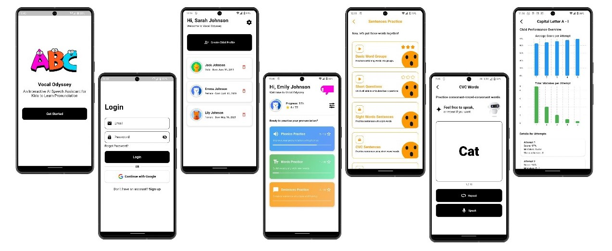

# 🌟 Vocal Odyssey

**Vocal Odyssey** is an innovative, AI-powered mobile application crafted to help young children improve their pronunciation and speech skills. Through structured, interactive, and gamified learning experiences, Vocal Odyssey transforms traditional passive learning into engaging, hands-on pronunciation training.

---

## ✨ Features

- **Interactive Level-Based Learning:** Kids progress through carefully structured levels: Phonics → Words → Sentences.
- **Active Speaking Practice:** Unlike typical learning apps, Vocal Odyssey encourages active speaking.
- **Real-Time AI Evaluation:** Speech is evaluated instantly using advanced AI tools to provide accurate feedback.
- **Gamified Rewards:** Children earn stars and rewards for correct pronunciation, keeping them motivated.
- **Text-to-Speech Integration:** High-quality voice output using Murf.ai ensures accurate word playback.
- **Progress Tracking:** Parents and teachers have access to detailed graphs and reports tracking the child's learning journey.
- **Admin Management:** Dedicated admin controls for managing users, levels, and learning modules.

---

## 🏗️ Technical Specifications

This project is built using a modern, scalable tech stack:

- **Frontend:** Flutter & Dart (Cross-platform mobile app development)
- **Backend:** Node.js with Express (RESTful APIs)
- **Database:** MongoDB (NoSQL data storage)
- **Third-Party APIs:**
  - **Speech-to-Text & Evaluation:** [Speechace](https://docs.speechace.com/)
  - **Text-to-Speech:** [Murf.ai API](https://murf.ai/api/docs/)

---

## 🚀 How to Run the App

To run Vocal Odyssey locally, you'll need both the **Frontend** and **Backend** running simultaneously.

### 1. Prerequisites
- **Flutter SDK** installed (for the mobile frontend)
- **Node.js & npm** installed (for the backend server)
- **MongoDB** installed and running locally, or a MongoDB Atlas URI
- API Keys for **Speechace** and **Murf.ai** (add these to your backend `.env` file)

### 2. Setting up the Backend
1. Open a terminal and navigate to the backend folder:
   ```bash
   cd backend
   ```
2. Install dependencies:
   ```bash
   npm install
   ```
3. Create a `.env` file in the `backend` directory (copy from `.env.example` if available) and add your database credentials and API keys.
4. Start the server:
   ```bash
   npm start
   ```
   *(Or `npm run dev` if you have nodemon configured).*

### 3. Setting up the Frontend
1. Open another terminal and navigate to the frontend folder:
   ```bash
   cd frontend
   ```
2. Get Flutter dependencies:
   ```bash
   flutter pub get
   ```
3. Update the backend API base URL in your Flutter configuration (if necessary) to point to your local machine's IP address instead of `localhost` (e.g., `http://192.168.x.x:3000`).
4. Run the app on an emulator or connected physical device:
   ```bash
   flutter run
   ```

---

## 📸 Screenshots



---

## 🎮 How to Use the App

Vocal Odyssey is designed with three distinct user roles, each offering unique functionalities to create a holistic learning environment.

### 1. Child Experience (Learning Mode)
- **Level Selection:** Children can navigate through carefully structured learning modules starting from fundamental **Phonics**, advancing to complete **Words**, and eventually **Sentences**.
- **Interactive Playground:** When a level is selected, the app uses text-to-speech to demonstrate the correct pronunciation. The child is then prompted to repeat the sound or word.
- **Real-Time Feedback & Rewards:** The app records the child's voice and evaluates their pronunciation instantly. Based on accuracy, the child earns stars and celebratory rewards to keep them engaged.
- **Progress Tracking:** Children can view their own "Avatar Progress" and see how many levels they've unlocked.

### 2. Supervisor (Parent/Teacher) Experience
- **Profile Management:** Supervisors can create and manage multiple child profiles under a single account.
- **Progress Monitoring:** Access detailed progress reports and overviews for each child. Supervisors can track pronunciation scores, identify areas for improvement, and monitor completed levels.
- **Personalized Settings:** Adjust learning settings tailored to the individual child's pace and needs.

### 3. Admin Experience
- **Content Management:** Admins have full control over the educational material. They can easily add, edit, or remove phonics, words, and sentences to keep the curriculum updated.
- **User Management:** Comprehensive tools to manage Supervisor and Child accounts across the platform.
- **System Dashboard:** A dedicated dashboard providing a top-level view of app usage and content metrics.
